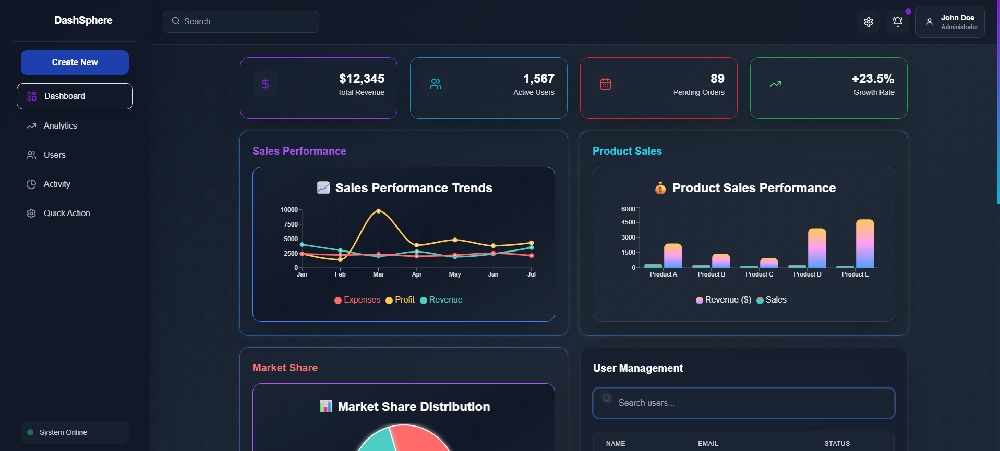
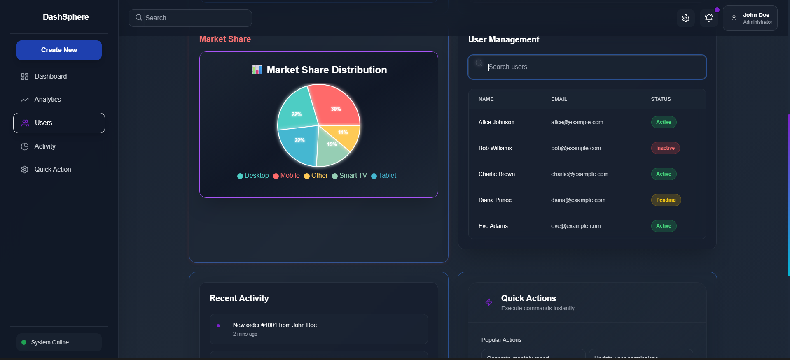

# React + Vite

This template provides a minimal setup to get React working in Vite with HMR and some ESLint rules.

Currently, two official plugins are available:

- [@vitejs/plugin-react](https://github.com/vitejs/vite-plugin-react/blob/main/packages/plugin-react) uses [Babel](https://babeljs.io/) for Fast Refresh
- [@vitejs/plugin-react-swc](https://github.com/vitejs/vite-plugin-react/blob/main/packages/plugin-react-swc) uses [SWC](https://swc.rs/) for Fast Refresh

## Expanding the ESLint configuration

If you are developing a production application, we recommend using TypeScript with type-aware lint rules enabled. Check out the [TS template](https://github.com/vitejs/vite/tree/main/packages/create-vite/template-react-ts) for information on how to integrate TypeScript and [`typescript-eslint`](https://typescript-eslint.io) in your project.

## Project Overview
It is a simple dashboard which can be used to track your sales, products, annual revenues , product market shares, It is fully customisable it can be built according to needs . The best thing about this dashboard is it can be built according to required needs.It is a responsive dashboard works on every screen sizes , Easily accessible from mobiles, Desktop or Tablets.

#### Built using React+Vite Tailwindcss Lenis FramerMotion Recharts Lucide-React

[Click here to view the DashShere Dashboard live ](https://dash-sphere.vercel.app/)

## Project Sreenshots 

